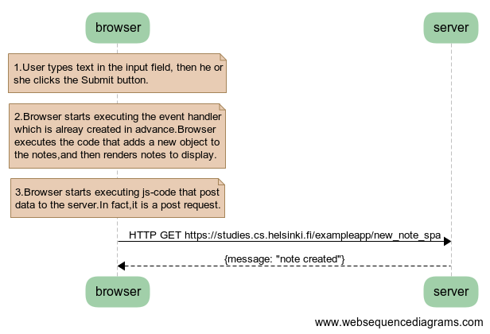

# task
```
note over browser:
1.User types text in the input field, then he or
she clicks the Submit button.
end note

note over browser:
2.Browser starts executing the event handler 
which is already created in advance.Browser 
executes the code that adds a new object to 
the notes,and then renders notes to display.
end note

note over browser:
3.Browser starts executing js-code that post 
data to the server.In fact,it is a post request.
end note

browser->server: HTTP GET https://studies.cs.helsinki.fi/exampleapp/new_note_spa
server-->browser: {message: "note created"}
```
# presentation


# problem
This task has a fault.Whatever the server returns，the new note will display on the browser.